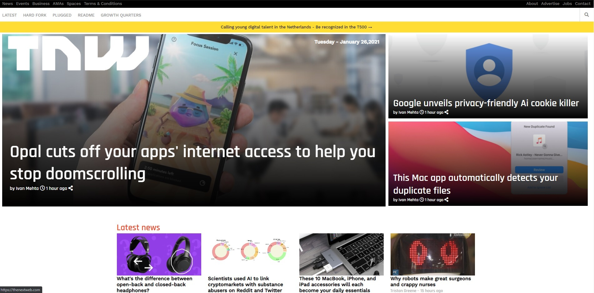

<h2><b>Week 2; Responsive web design project</b></h2>

The assignment is to clone a The Next Web page.

 

The general purpose of the project was to practice HTML & CSS  rules applied with media querries.
 
<h3><b>Built with</b></h3>

<ul>
  <li>HTML & CSS</li> 
  <li>Technologies include CSS flexbox, floats and grid</li>
  <li>CSS media querries for mobile, tablet and desktop preview</li>
  <li>Universal HTML structure for media querries</li>
  <li>CSS preprocessors</li>
</ul>
 
<h3><b>Live Demo</b></h3>

<a href="https://loosescrew022.github.io/Responsive-Web-Design/">Live Demo Link</a> 
<h3><b>Getting Started</b></h3>

To get a local copy up and running follow these simple example steps

 
<h4><b>Prerequisites:</b></h4>Linters script to check bugs and errors
<h4><b>Setup:</b></h4><ul>
                         <li>Setup Linters in .github/workflows</li>
                      </ul>                             
                                                       
<h3><b>Authors</b></h3>

 👤 Author 
   
<ul>
  <li>GitHub: <a href="https://github.com/Loosescrew022">Piotr Rutkowski</a></li>
  <li>Twitter: <a href="https://twitter.com/P_Rutkowski022">Piotr Rutkowski</a></li>
  <li>LinkedIn: <a href="https://www.linkedin.com/in/piotr-rutkowski-145004207/">Piotr Rutkowski</a></li>
</ul  
  
 

 👤 Author 
   
<ul>
  <li>GitHub: <a href="https://github.com/danmainah">Dan Mainah</a></li>
  <li>Twitter: <a href="https://twitter.com/dan_mainah">Dan Mainah</a></li>
  <li>LinkedIn: <a href="www.linkedin.com/in/daniel-maina-315a38191">Daniel Maina</a></li>
</ul   

<h3><b>Contributing</b></h3>

Contributions, issues, and feature requests are welcome! 
Feel free to check the<a href="https://github.com/Loosescrew022/Responsive-Web-Design/issues"> issues</a> page.

<h3><b>Show your support</b></h3>
Give a ⭐️ if you like this project!

<h3><b>Acknowledgments</b></h3>

<ul>
  <li>Hat tip to anyone whose code was used</li>
  <li>Inspiration etc</li>
</ul>
 
<h3><b>License</b></h3>

This project is MIT licensed.
